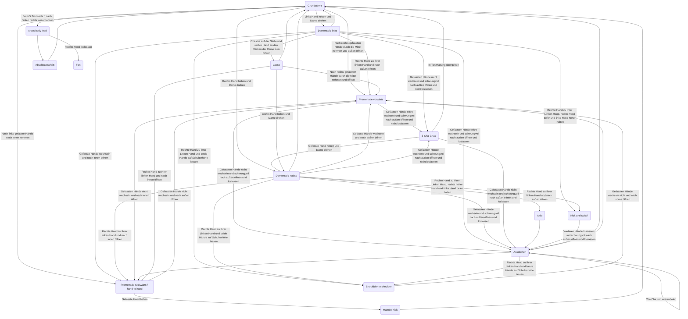

# Cha Cha Cha

<a href="../overview-de.md">Zurück zur Übersicht der Tänze</a>

## Playlist:

<a href="">Nachfragen ob ich die öffentlich hier teilen darf?</a>

## Figuren

```mermaid
flowchart TB;
    Grundschritt(Grundschritt) -->|Links Hand heben und Dame drehen| DamensoloLinks(Damensolo links) --> Grundschritt;
    Grundschritt -->|Rechts Hand heben und Dame drehen| DamensoloRechts(Damensolo rechts) --> Grundschritt;
    Grundschritt -->|Nach rechts gefassten Hände durch die Mitte nehmen und außen öffnen| PromenadeVorwaerts(Promenade vorwärts);
    DamensoloLinks -->|Rechte Hand zu Ihrer linken Hand und nach außen öffnen| PromenadeVorwaerts;
    DamensoloRechts -->|Gefasste Hände wechseln und nach außen öffnen| PromenadeVorwaerts;
    Grundschritt -->|Nach links gefasste Hände nach innen nehmen| HandToHand(Promenade rückwärts / hand to hand);
    DamensoloLinks -->|Gefasste Hände wechseln und nach innen öffnen| HandToHand;
    DamensoloRechts -->|Rechte Hand zu Ihrer linken Hand und nach innen öffnen| HandToHand;
    PromenadeVorwaerts -->|Gefassten Hände nicht wechseln und nach innen öffnen| HandToHand;
    HandToHand -->|Gefassten Hände nicht wechseln und nach außen öffnen| PromenadeVorwaerts;
    PromenadeVorwaerts -->|Gefassten Hände nicht wechseln und schwungvoll nach außen öffnen und loslassen| Ausdrehen(Ausdrehen);
    DamensoloLinks -->|Gefassten Hände nicht wechseln und schwungvoll nach außen öffnen und loslassen| Ausdrehen;
    DamensoloRechts -->|Gefassten Hände wechseln und schwungvoll nach außen öffnen und loslassen| Ausdrehen;
    Ausdrehen --> Grundschritt;
    Ausdrehen --> PromenadeVorwaerts;
    Ausdrehen --> HandToHand;
    Ausdrehen -->|Cha Cha und wiederholen| Ausdrehen;
    PromenadeVorwaerts -->|Gefassten Hände nicht wechseln und schwungvoll nach außen öffnen und nicht loslassen| 3ChaChas(3-Cha-Chas);
    DamensoloLinks -->|Gefassten Hände nicht wechseln und schwungvoll nach außen öffnen und nicht loslassen| 3ChaChas;
    DamensoloRechts -->|Gefassten Hände wechseln und schwungvoll nach außen öffnen und nicht loslassen| 3ChaChas;
    3ChaChas -->|In Tanzhaltung übergehen| Grundschritt;
    3ChaChas -->|Gefasste Hand heben und Dame drehen| DamensoloRechts;
    3ChaChas -->|Gefassten Hände nicht wechseln und schwungvoll nach außen öffnen und loslassen| Ausdrehen;
    DamensoloLinks -->|Rechte Hand zu Ihrer Linken Hand und beide Hände auf Schulterhöhe lassen| ShouldderToShouldder(Shouldder to shoulder);
    DamensoloRechts -->|Rechte Hand zu Ihrer Linken Hand und beide Hände auf Schulterhöhe lassen| ShouldderToShouldder;
    Ausdrehen -->|Rechte Hand zu Ihrer Linken Hand und beide Hände auf Schulterhöhe lassen| ShouldderToShouldder;
    ShouldderToShouldder -->|Gefassten Hände wechseln nicht und nach vorne öffnen| PromenadeVorwaerts;
    HandToHand -->|Gefasste Hand heben| MamboKick(Mambo Kick) --> Grundschritt;
    DamensoloLinks -->|Cha cha auf der Stelle und rechte Hand an den Rücken der Dame zum führen| Lasso(Lasso);
    Lasso --> Grundschritt;
    Lasso -->|rechts Hand heben und Dame drehen| DamensoloRechts;
    Lasso -->|Nach rechts gefassten Hände durch die Mitte nehmen und öffnen| PromenadeVorwaerts;
    Lasso -->|Rechte Hand zu Ihrer linken Hand und nach innen öffnen| HandToHand;
    Grundschritt -->|Beim 5.Takt seitlich nach hinten rechts weiter tanzen| CrossBodyLead(cross body lead);
    CrossBodyLead --> Abschlussschritt(Abschlussschritt) --> Grundschritt;
    CrossBodyLead -->|Rechte Hand loslassen| Fan(Fan);
    DamensoloRechts -->|Rechte Hand zu Ihrer linken Hand und nach außen öffnen| Aida(Aida) --> Ausdrehen;
    DamensoloLinks -->|Rechte Hand zu Ihrer Linken Hand, rechte Hand tiefer und linke Hand höher halten | KickAndTwist(Kick and twist?);
    DamensoloRechts -->|Rechte Hand zu Ihrer Linken Hand, rechte höher Hand und linke Hand tiefer halten| KickAndTwist;
    KickAndTwist -->|Vorderen Hände loslassen und schwungvoll nach außen öffnen und loslassen | Ausdrehen;
```
